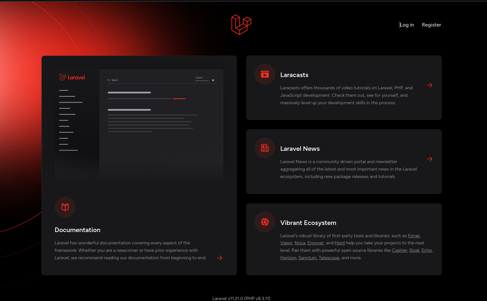
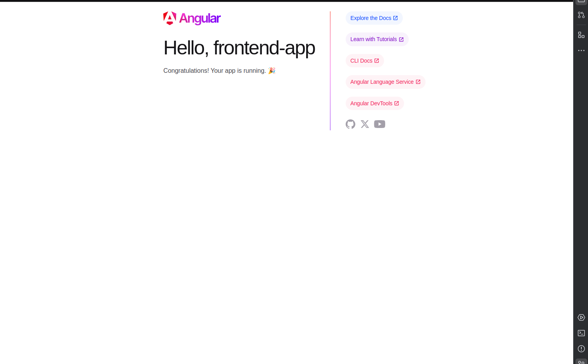

# Angular - Laravel - Docker

A simple starter-kit for laravel-angular applications. 

## Getting started

Install [Docker](https://docs.docker.com/engine/install/) and [Docker Compose](https://docs.docker.com/compose/install/)

Launch [Traefik](https://doc.traefik.io/traefik/getting-started/quick-start/) With the Docker Provider

Use [Alphaws/traefik](https://github.com/Alphaws/traeefik)

```shell
git pull git@github.com:Alphaws/angular-laravel-docker.git
cd angular-laravel-docker
bin/init
```

Edit ./.env FRONTEND_HOST and BACKEND_HOST if you want.
Edit ./backend/.env and update APP_URL to https://ald-backend.localhost

Open [Backend](https://ald-backend.localhost) and [Frontend](https://ald.localhost/) 





Thanks

 @todo: Auto sync .env HOSTs and URLs 
